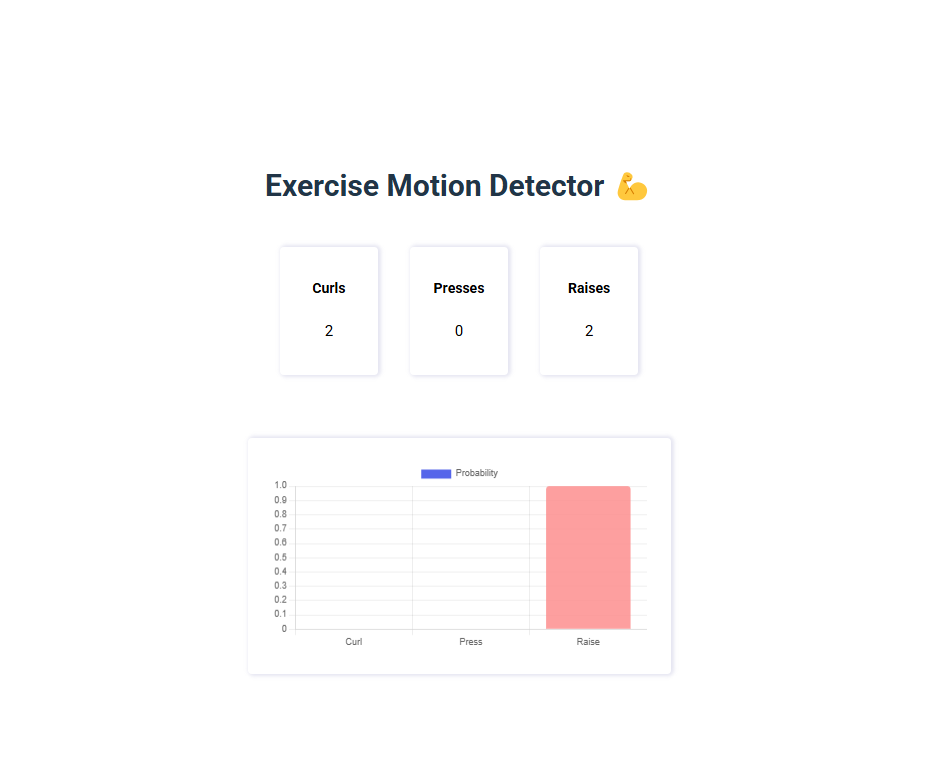

# Exercise Recognition
A machine learning project that classifies the current exercise you are doing and displays it on a website.  It utilizes a 1D Convolutional Neural Network to process a 2 second window of accelerometer and gyroscopic data.  Then, it classifies the window as either a Bicep Curl, an Overhead Press, or a Lateral Raise.  

This project requires a microcontroller with a LSM9DS1 IMU unit. 

## Installation
- Run npm install in the [app](demo/app) and [server](demo/server) folder respectively.  
- Load [inference.ino](src/inference/inference.ino) into your microcontroller
- Check the COM port your micro controller uses
- Change [serialPort variable](demo/server/index.js) to the COM port your microcontroller uses
- Run in [index.js](demo/server/index.js)
- Go to localhost:2904
